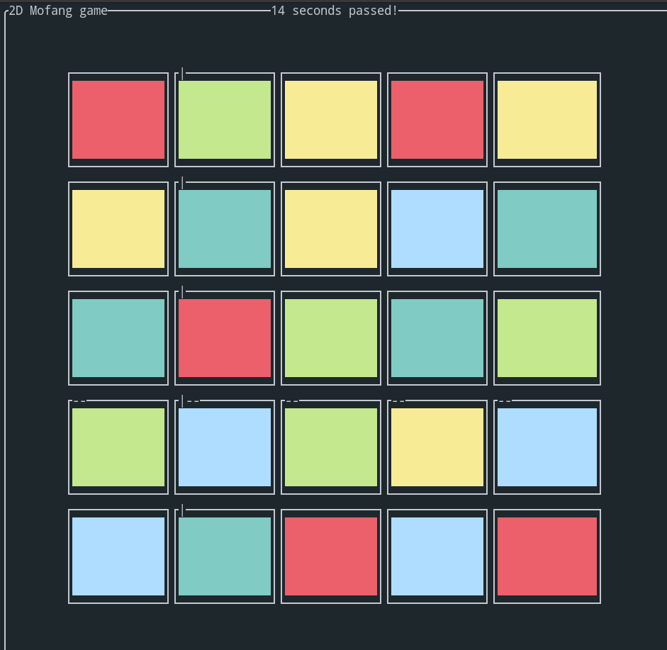

# mofang

It's a simple but fun game written in rust using tui-rs

## game rules

Press <key>Up</key>, <key>Down</key>, <key>Left</key>, <key>Right</key> to control move the horizontal or vertical line, press <key>A</key> and <key>S</key> to toggle a row or column. The goal is to make every row has the same color.

## how to build

```bash
cargo run
```

## screenshot


